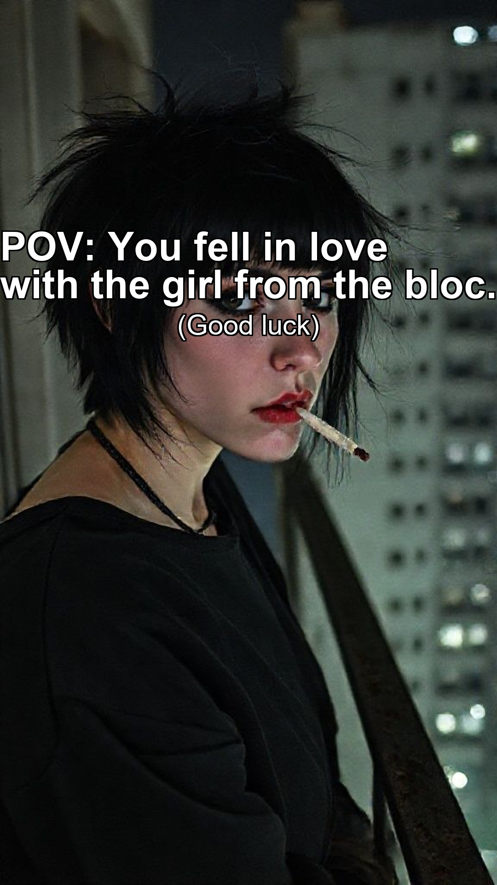
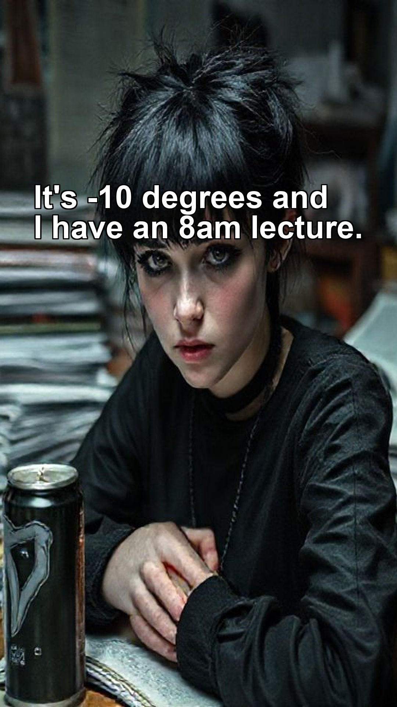
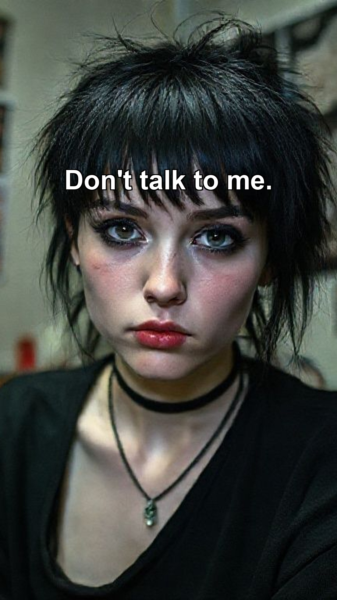
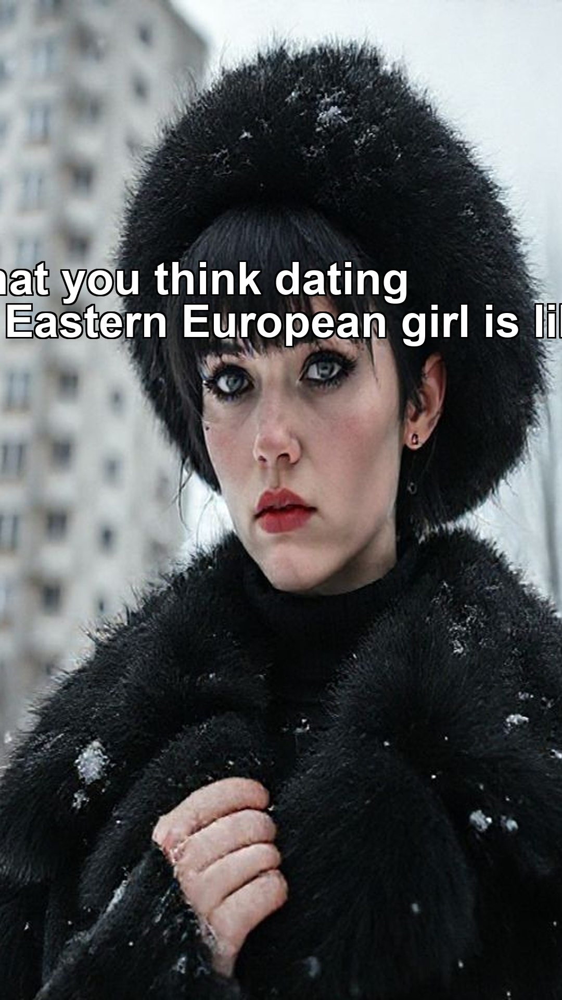
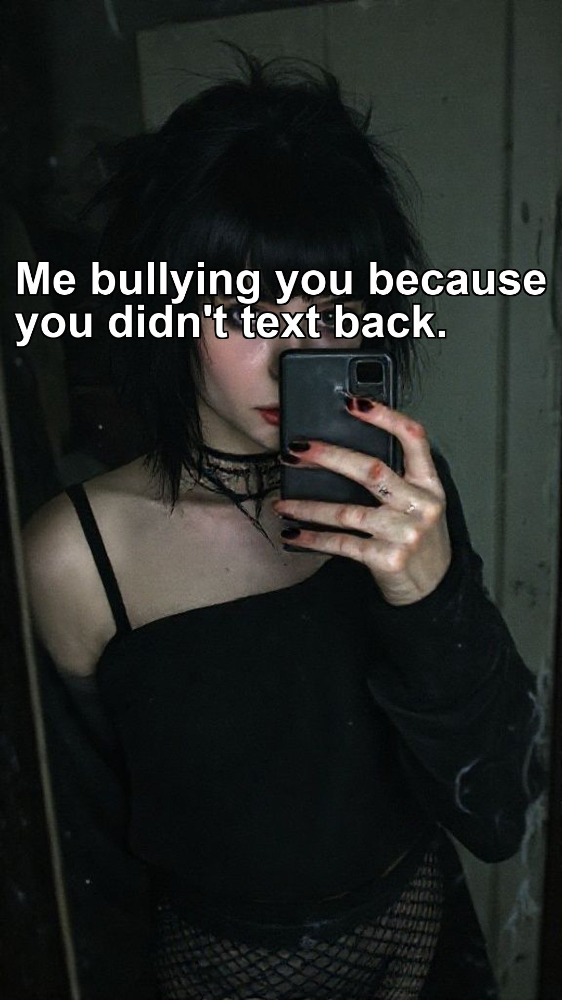
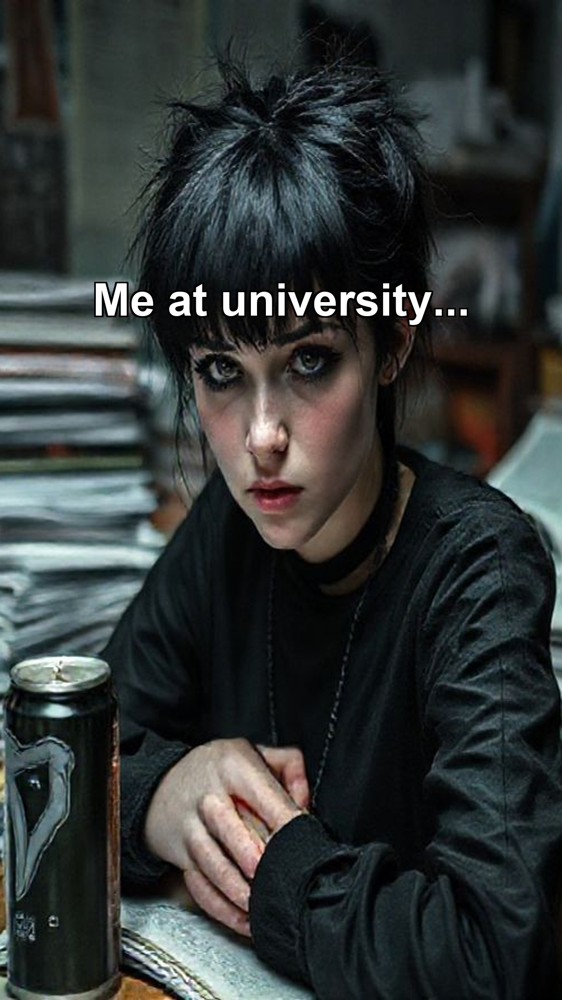
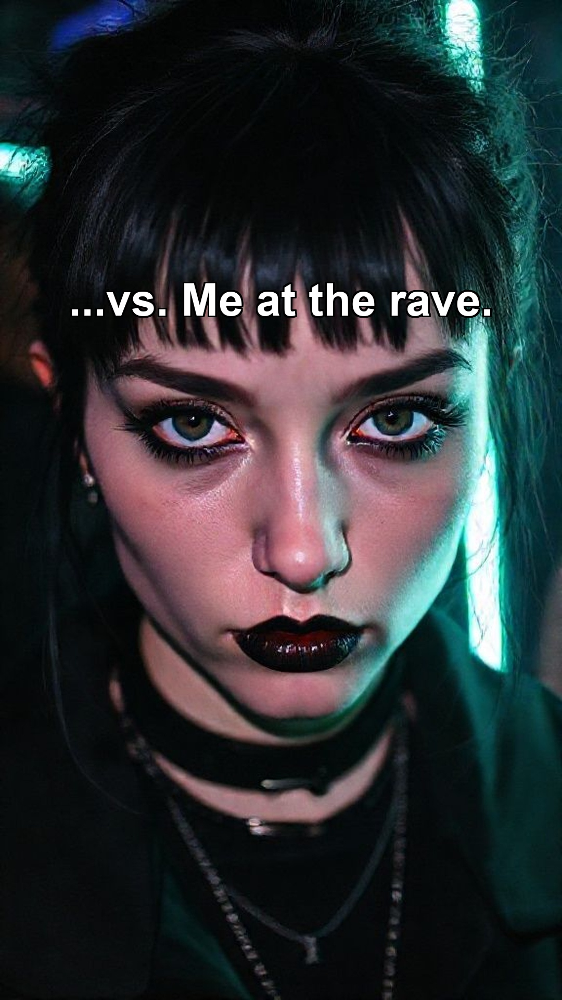

# 📱 TikTok Content: Ready to Upload

I have processed your images into **TikTok Photo Slides** with the correct text overlays and 9:16 aspect ratio.

## How to Post
1.  Open TikTok -> Click `+` -> Select "Photo" mode.
2.  Select the images in the order shown below.
3.  Add the suggested music.

---

## 🎬 Video 1: The Intro / Vibe Check
**Sound:** "Sudno" (Molchat Doma) or "Keraunos" (Playaphonk)

**Slide 1:** (Hook)

**Slide 2:** (Reality)

**Slide 3:** (Punchline)

---

## 🎬 Video 2: Relatability / "Types of Girls"
**Sound:** Viral "She's crazy but she's free" audio

**Slide 1:** (Expectation)

**Slide 2:** (Reality)

---

## 🎬 Video 3: Transformation / Glow Up
**Sound:** Phonk transition (e.g. "Close Eyes" - DVRST)

**Slide 1:** (Before/Uni)

**Slide 2:** (After/Rave)

