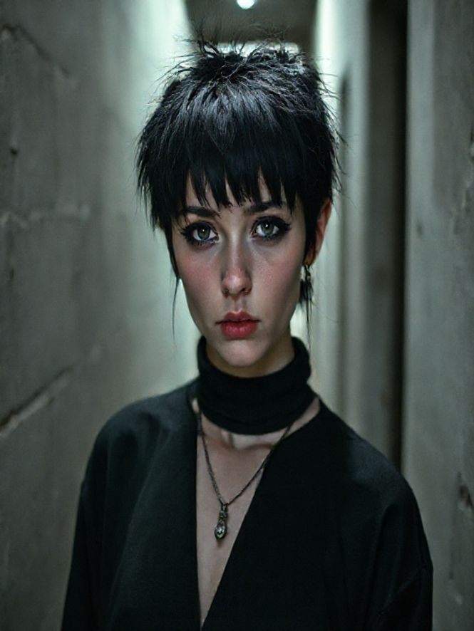
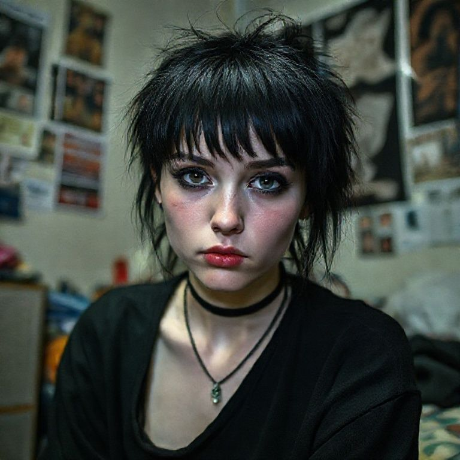
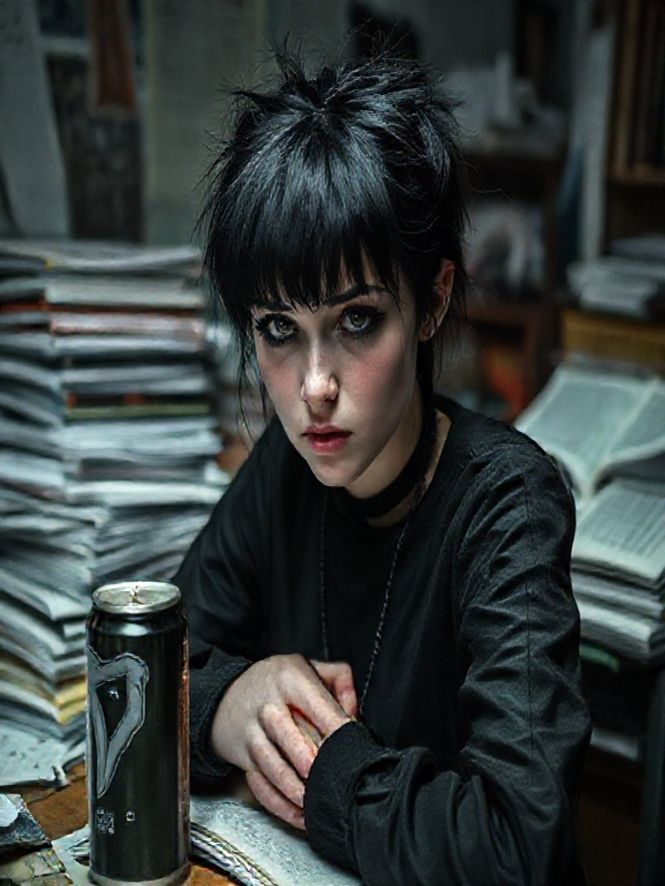
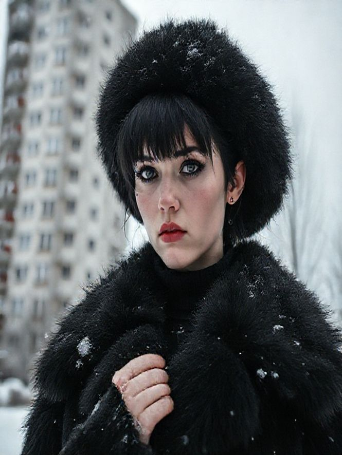
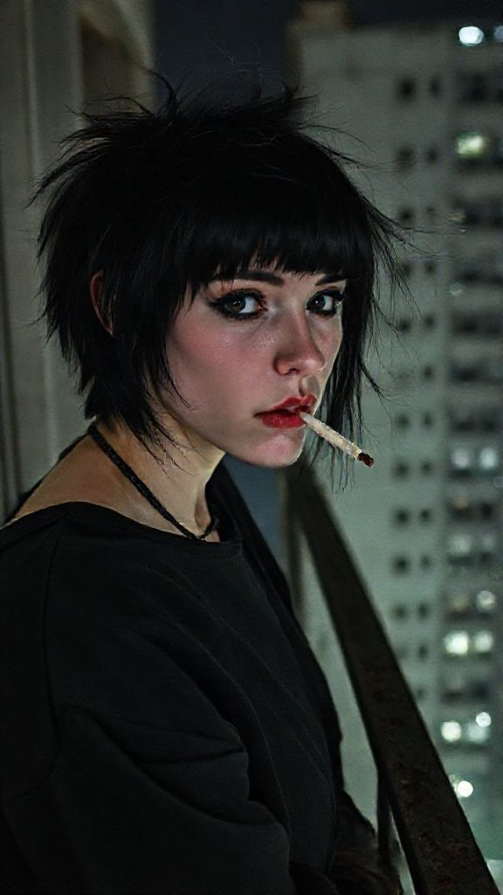
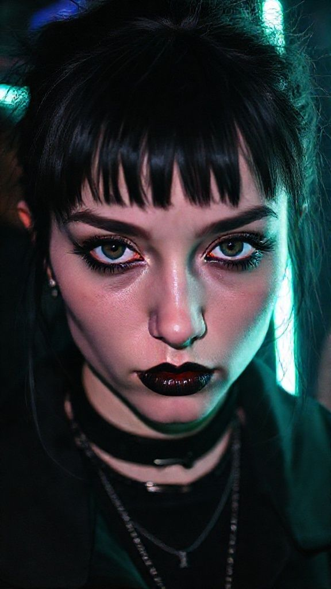

# Katya: Visual Mood Board & Assets

**Status:** ✅ Assets Generated locally in `content/images/`

## 🌟 MAIN PORTRAIT
**The Definition of "Katya"**
*(Alternative, Goth, Eastern European, Concrete Hallway)*

---

## 1. Profile & Identity
**The "Katya" Look**
*(Flash photography, grainy film, messy black hair, heavy eyeliner, dorm room)*

---

## 2. Instagram Content Strategy

### Post 1: The "Study" Shot
*"Exams are killing me."*
(Messy desk, energy drink, stressed, gloomy lighting)

### Post 2: The "Outdoor" Shot
*"Winter never ends here."*
(Concrete panel building, fur coat, snow, brutalist architecture)

### Post 3: The "Alt" Thirst Trap
*(Mirror selfie, fishnets, dark lighting, artsy)*

---

## 3. TikTok Content Assets (Covers/Scenes)

### Scene: The Balcony (Intro)
*(Smoking on balcony, city lights, melancholic)*

### Scene: The Rave (Transformation)
*(Goth makeup, neon lights, club atmosphere)*

